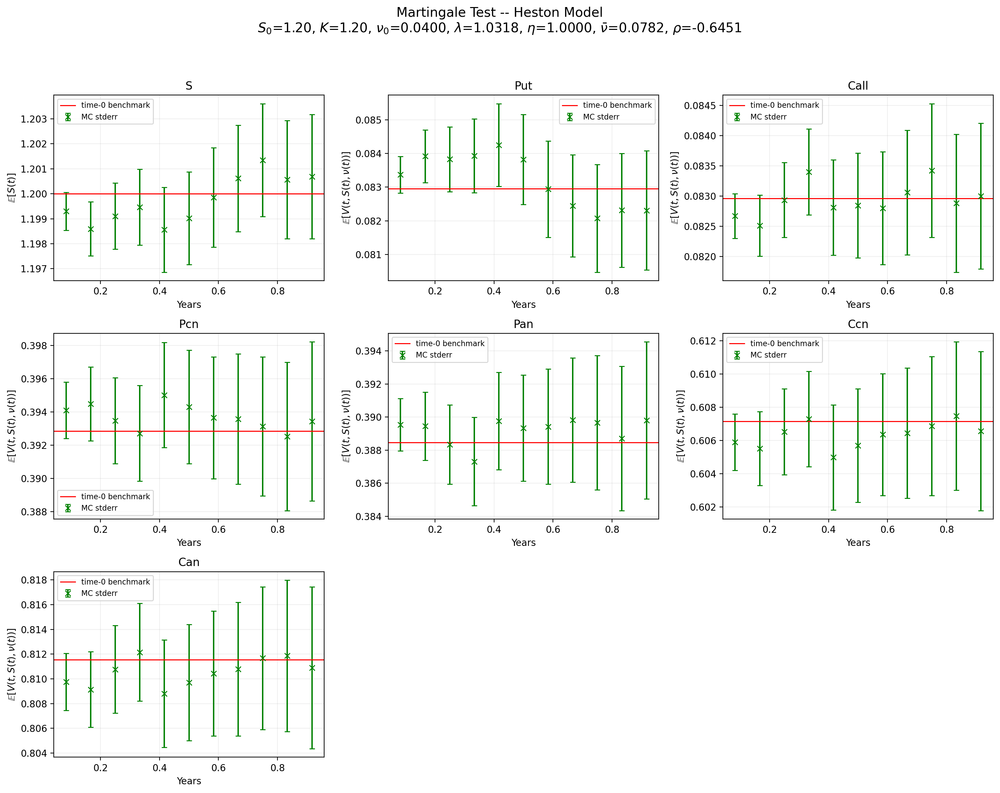

# Martingale Verification under the Heston Stochastic Volatility Model

Fourier pricing, quadratic-exponential simulation, and vectorised pathwise repricing.

Under a risk-neutral measure with `r = q = 0`, both the stock price and the continuation
value of every European claim must be martingales. This project verifies that numerically
for the Heston model: it prices six European-type claims at `t = 0` by SINC Fourier
inversion, simulates the joint `(S, ν)` state on a monthly grid, and reprices every claim
from every simulated state to check that

```
E[S_t]                = S_0
E[V_O(t, S_t, ν_t)]   = O(S_0, T)
```

holds at each monitoring date, within Monte Carlo error.

**Result:** across all seven quantities and all eleven intermediate dates, the largest
deviation from the time-0 benchmark is **1.3 standard errors** — comfortably inside the
1.96 threshold for a 5% two-sided test.



---

## What makes this non-trivial

**Repricing without nested Monte Carlo.** The obvious way to value a claim at an
intermediate state is to simulate fresh inner paths from it. With 8192 outer paths and 11
dates, even a modest 10³ inner paths means ~9.0 × 10⁷ trajectories — benchmarked at roughly
41 minutes, and it contaminates the estimator with inner-sampling noise.

Instead this implementation exploits the affine form of the Heston characteristic function.
Since

```
log φ(k, τ, ν_t) = A(k, τ) − ν_t · B(k, τ)
```

the coefficients `A` and `B` depend only on the Fourier mode and the residual maturity —
never on the path. They are computed once per mode as complex scalars and broadcast across
all 8192 variance states at once, collapsing the SINC loop from `O(N × M)` scalar
evaluations to `O(M)` array operations. The whole run finishes in **6.24 s**, about **490×**
faster than the nested alternative, and returns exact continuation values rather than noisy
estimates.

**The Feller condition is violated.** With `2λν̄/η² ≈ 0.1614`, the variance process reaches
zero with non-negligible probability. A naive discretisation would push it negative. The
variance path is therefore simulated with Andersen's quadratic-exponential scheme, and the
spot with the exact conditional scheme of Broadie–Kaya given the integrated variance.

**A rejected optimisation, documented.** Since the number of SINC modes needed for
convergence scales as ~1/τ (255 terms at τ = 0.92, rising to 2445 at τ = 0.08), scaling the
Fourier cutoff as `X_c√τ` looks attractive and does cut total work by 46%. It also biases
the put continuation value low by 5.9% (≈2.8σ) at the shortest maturity, so it is
implemented but not used. Section 4.8 of the report has the numbers.

---

## Claims priced

| Claim | Definition | Time-0 price |
|---|---|---|
| Call | `E[(S_T − K)⁺]` | 0.082958 |
| Put | `E[(K − S_T)⁺]` | 0.082958 |
| `P_cn` | `E[1{K > S_T}]` | 0.392848 |
| `P_an` | `E[S_T · 1{K > S_T}]` | 0.388460 |
| `C_cn` | `E[1{K < S_T}]` | 0.607152 |
| `C_an` | `E[S_T · 1{K < S_T}]` | 0.811540 |

Put = Call by parity (at-the-money, `r = q = 0`). The digitals are asymmetric about ½
because of the leverage effect (`ρ = −0.645`).

---

## Running it

```bash
pip install -r requirements.txt
python3 heston_martingales.py
```

Defaults reproduce every figure in the report exactly (seed 29283). Results print to the
terminal; the plot and a CSV summary are written to `./heston_outputs/`.

Useful flags:

```bash
python3 heston_martingales.py --help          # full option list
python3 heston_martingales.py -n 15           # 2^15 paths instead of 2^13
python3 heston_martingales.py -xcmode sqrt_tau  # maturity-scaled Fourier cutoff
python3 heston_martingales.py -out ./results  # alternative output directory
```

### Parameters

| Symbol | Value | | Symbol | Value |
|---|---|---|---|---|
| `S_0` | 1.2 | | `λ` | 1.03179746 |
| `K` | 1.2 | | `ν̄` | 0.07819284 |
| `T` | 1.0 | | `η` | 1.0 |
| `N` | 2¹³ = 8192 | | `ν_0` | 0.04 |
| `Δt` | 1/730 | | `ρ` | −0.6450755 |
| `X_c` | 5.0 | | seed | 29283 |

---

## Repository layout

```
heston_martingales.py          main script — pricing, simulation, martingale test
heston_martingale_report.pdf   full write-up: derivations, results, discussion
heston_outputs/
  martingale_diagnostics.png   7-panel diagnostic figure
  heston_summary.csv           MC means, standard errors, benchmarks
CFLib/                         course library (see NOTICE.md)
requirements.txt
```

---

## Report

[**Full report (PDF)**](heston_martingale_report.pdf) — model and pricing identities,
methodology, monthly diagnostics for all seven quantities, computational cost analysis,
Fourier cutoff sensitivity, and limitations.

---

## Attribution

`CFLib/` is the teaching library of **Prof. Pietro Rossi** (Department of Statistical
Sciences, University of Bologna), used in the Computational Finance course. It is included
unmodified and trimmed to the eight modules this project actually imports, purely so the
repository runs standalone. It is **not** my work and is redistributed here for
reproducibility only — see [`CFLib/NOTICE.md`](CFLib/NOTICE.md). The SINC pricing method it
implements is published in Baschetti, Bormetti, Romagnoli & Rossi, *The SINC way: a fast and
accurate approach to Fourier pricing*, Quantitative Finance 22(3), 2022.

Everything outside `CFLib/` — `heston_martingales.py`, the report, and this README — is my
own work, produced as a coursework project for the M.Sc. in Quantitative Finance at the
University of Bologna.

## References

1. Heston, S. L. (1993). *A closed-form solution for options with stochastic volatility.* Review of Financial Studies 6(2), 327–343.
2. Andersen, L. B. G. (2008). *Simple and efficient simulation of the Heston stochastic volatility model.* Journal of Computational Finance 11(3), 1–42.
3. Broadie, M. & Kaya, Ö. (2006). *Exact simulation of stochastic volatility and other affine jump diffusion processes.* Operations Research 54(2), 217–231.
4. Baschetti, F., Bormetti, G., Romagnoli, S. & Rossi, P. (2022). *The SINC way: a fast and accurate approach to Fourier pricing.* Quantitative Finance 22(3), 427–446.

---

**Mahed Ali** · [mahed.ali@hotmail.com](mailto:mahed.ali@hotmail.com)
